# Socialpal — Social Life on Auto-Pilot

**Relationship Intelligence, Automated.**
DEMO https://devyanshh22.github.io/social-autopilot/

An AI-driven relationship intelligence dashboard that analyzes your messaging patterns, scores relationship health, detects anomalies, and generates actionable recommendations — all running client-side in the browser.

## Architecture

```mermaid
graph LR
    A[Raw Chat Data<br/>450+ messages] --> B[Ingestion<br/>Parse & Group]
    B --> C[Metrics Engine<br/>12 metrics/contact]
    C --> D[Health Scorer<br/>Weighted 0-100]
    D --> E[Anomaly Detector<br/>5 anomaly types]
    E --> F[Action Generator<br/>Priority queue]
    F --> G[Dashboard UI<br/>Interactive React]

    style A fill:#38bdf8,stroke:#0284c7,color:#000
    style B fill:#818cf8,stroke:#6366f1,color:#000
    style C fill:#818cf8,stroke:#6366f1,color:#000
    style D fill:#10b981,stroke:#059669,color:#000
    style E fill:#f59e0b,stroke:#d97706,color:#000
    style F fill:#ec4899,stroke:#db2777,color:#000
    style G fill:#8b5cf6,stroke:#7c3aed,color:#000
```



## Tech Stack

- **React 18** with Vite for fast development
- **Tailwind CSS v4** — dark theme, glassmorphism, gradients
- **Recharts** — line charts, bar charts, interactive tooltips
- **Lucide React** — modern icon library
- **Framer Motion** — smooth animations and transitions
- All logic runs **client-side** in JavaScript
- Synthetic data bundled as JS modules

## Quick Start

```bash
cd social-autopilot
npm install
npm run dev
```

Open `http://localhost:5173` in your browser.

## Pipeline

### 1. Data Ingestion (`ingest.js`)
Parses raw chat arrays, groups messages by contact, sorts chronologically, and identifies primary communication platforms per contact.

### 2. Metric Extraction (`metrics.js`)
Computes 12+ metrics per contact: reciprocity ratio, response times, message frequency, frequency trends, conversation depth, initiation patterns, peak activity hours, and weekly sparkline data.

### 3. Health Scoring (`scorer.js`)
Calculates a weighted 0-100 relationship health score using six normalized sub-scores: reciprocity (20%), frequency (20%), recency (20%), trend (15%), depth (15%), and initiation balance (10%). Classifies into Thriving/Stable/Cooling/At-Risk/Dormant.

### 4. Anomaly Detection (`anomaly.js`)
Identifies five anomaly types: Sudden Drop (>50% frequency decrease), Ghost Mode (>14 days no reply), One-Sided (reciprocity <0.3), Missed Follow-Up (unanswered questions), and Fading Pattern (3+ weeks declining).

### 5. Action Generation (`actions.js`)
Produces prioritized action items (Urgent/Important/Suggested) with AI-style suggested messages, contextual reasoning, and relationship-specific recommendations.

## Scoring Methodology

```
Score = reciprocity(0.20) + frequency(0.20) + recency(0.20)
      + trend(0.15) + depth(0.15) + initiation(0.10)

Classifications:
  82-100  Thriving  💚
  68-81   Stable    💙
  50-67   Cooling   💛
  30-49   At-Risk   🟠
  0-29    Dormant   🔴
```

## Future Scope

- **Real Chat API Integrations** — WhatsApp Business API, Instagram Graph API, Gmail API
- **Persistent Storage** — IndexedDB or cloud sync for historical data
- **ML-Based Sentiment Analysis** — NLP on message content for emotional tone scoring
- **Push Notification System** — Browser/mobile alerts for urgent actions
- **Multi-Platform Aggregation** — Unified relationship view across all messaging platforms
- **Smart Scheduling** — AI-suggested optimal times to reach out based on patterns
- **Group Chat Analysis** — Relationship dynamics within group conversations

## Author

Built by **Divyaansh** For Codebase
